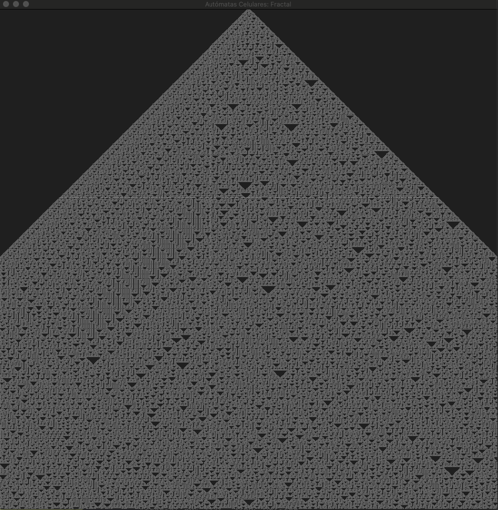
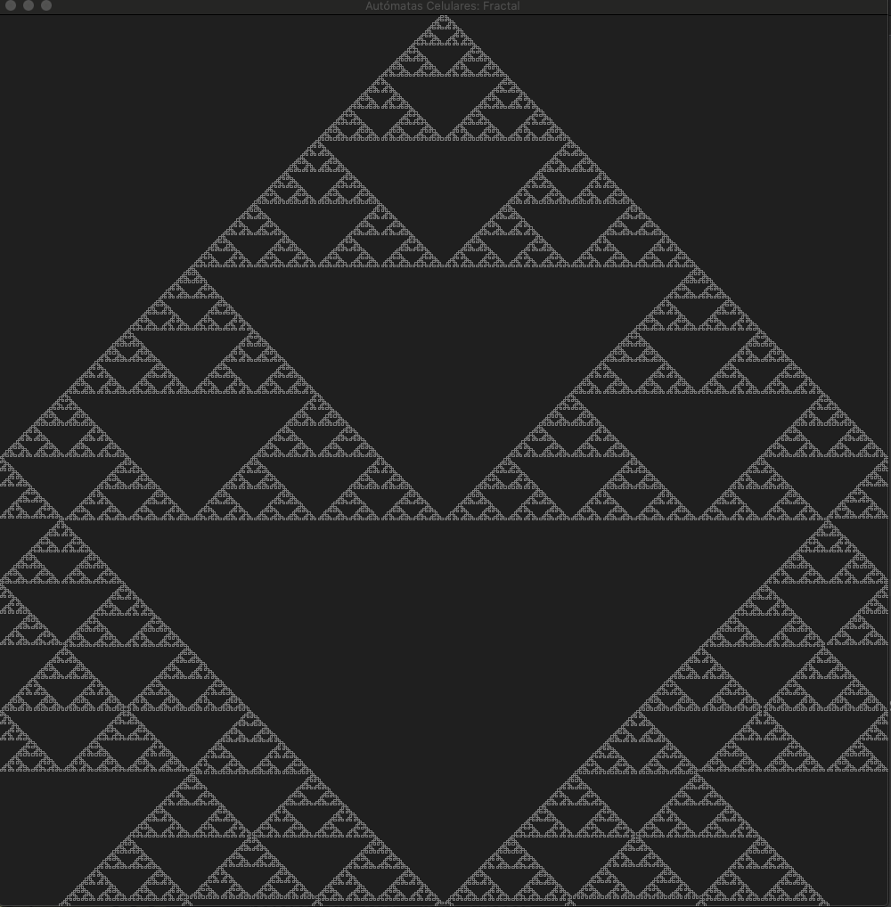
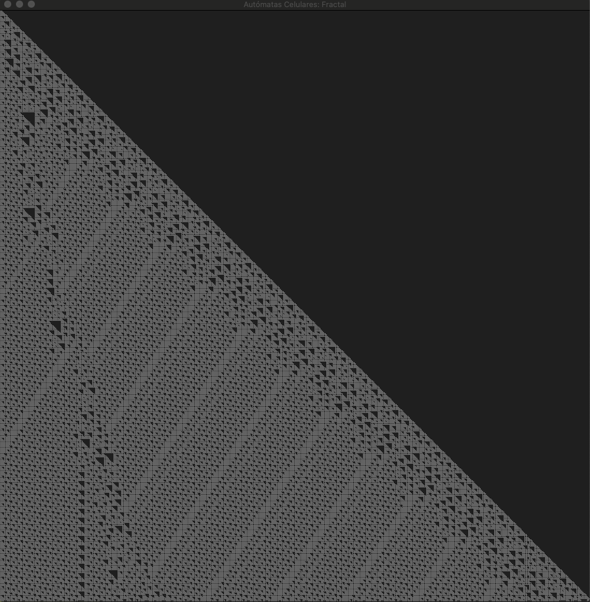

# Autómata Celular Unidimensional: Fractal

## Install

```python
python3 -m pip install pygame numpy --user
```

Run `python3 fractal.py`

### Rule 30

<p align="center">
  <kbd>
    
  </kbd>
</p>

### Rule 90

<p align="center">
  <kbd>
    
  </kbd>
</p>

### Rule 110

<p align="center">
  <kbd>
    
  </kbd>
</p>

### Rule 124

<p align="center">
  <kbd>
    
  </kbd>
</p>

### Rule 150

<p align="center">
  <kbd>
    
  </kbd>
</p>

references:

- [Descripción y Aplición de los Autómatas Celulares](/docs/Arti_Ver_Inv_2011_DARG.pdf)

